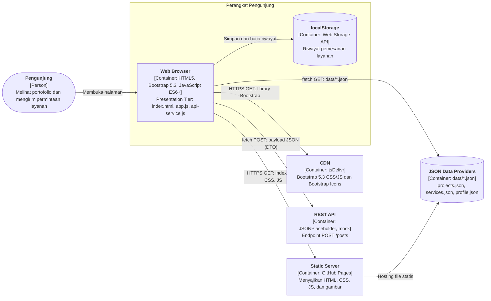
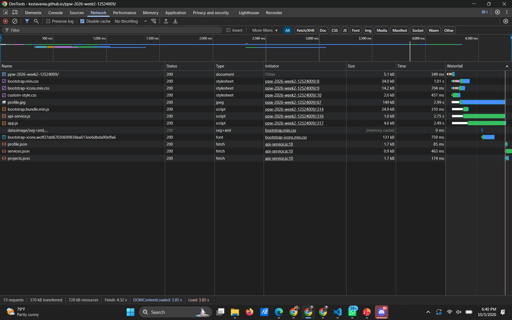
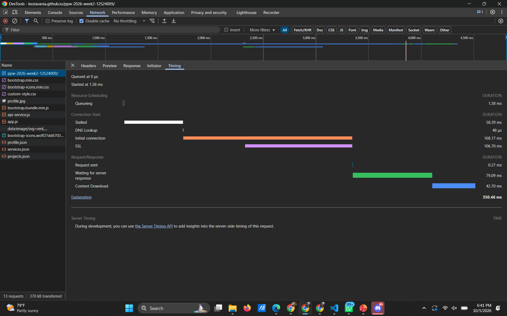
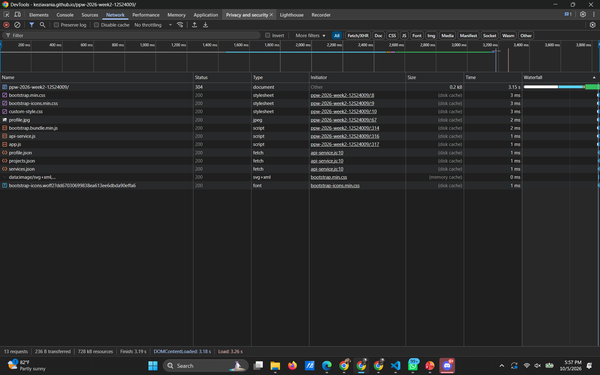
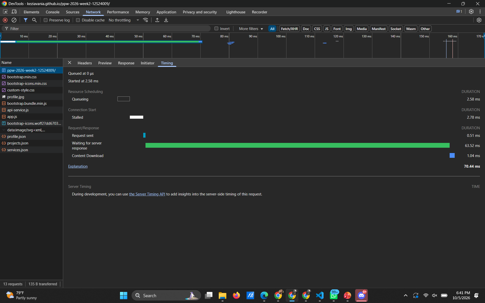
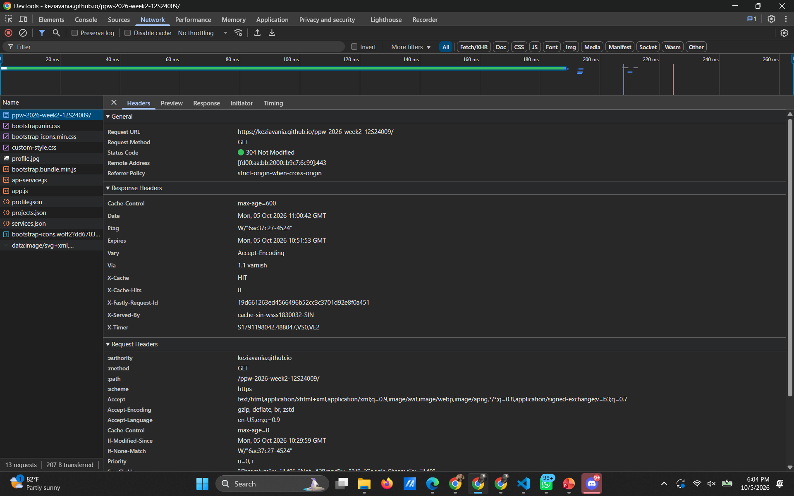

# Refactoring Arsitektural Portofolio Web Minggu 04 (Decoupled Multi-Tier & Dynamic CSR)

* **Nama:** Kezia Vania Pasaribu
* **NIM:** 12S24009
* **Program Studi:** S1 Sistem Informasi
* **Mata Kuliah:** Pemrograman dan Pengujian Web (12S3101)
* **Dosen Pengampu:** Chandro Pardede, S.Kom., M.Sc.
* **Live Demo:** [https://keziavania.github.io/ppw-2026-week2-12S24009/](https://keziavania.github.io/ppw-2026-week2-12S24009/)

---

## 1. Diagram Arsitektur Sistem (C4 Container Model)



### Pemetaan Tiga Tier

| Tier | Komponen pada Proyek | Tanggung Jawab |
| :--- | :--- | :--- |
| **Presentation Tier** | `index.html`, `css/custom-style.css`, `js/app.js` | Merakit DOM, mengelola 4 UI state, filter kategori, modal, dan interaksi form. |
| **Application / API Logic Tier** | `js/api-service.js`, REST API tiruan (JSONPlaceholder) | Mengatur pemanggilan HTTP, penanganan error, dan kontrak data JSON. |
| **Data Storage Tier** | `data/*.json`, `localStorage` | Menyimpan data portofolio, katalog layanan, dan riwayat pemesanan sisi klien. |

### Narasi Separation of Concerns (SoC)

Pada Minggu 3, seluruh konten portofolio tertanam langsung di dalam `index.html`, sehingga satu berkas memegang struktur halaman, data proyek, isi modal, dan katalog layanan sekaligus. Kondisi ini membuat perubahan sekecil apa pun, misalnya mengganti deskripsi proyek, mengharuskan penyuntingan markup dan berisiko merusak tata letak. Pada Minggu 4, tanggung jawab tersebut dipisah menjadi tiga lapisan dengan batas yang jelas. Lapisan data berada di direktori `data/` sebagai tiga berkas JSON mandiri yang bertindak sebagai penyedia data tiruan bergaya RESTful. Lapisan akses data berada di `api-service.js`, yang hanya mengurus pemanggilan `fetch`, pengecekan status HTTP, dan pelemparan error tanpa menyentuh DOM. Lapisan presentasi berada di `app.js`, yang menerima data dari lapisan di bawahnya lalu merakit kartu, modal, dan riwayat pesanan di browser.

Pemisahan ini membawa beberapa manfaat. Pertama, data dapat diubah tanpa menyentuh kode tampilan, dan sebaliknya tampilan dapat didesain ulang tanpa menyentuh data. Kedua, `app.js` tidak perlu tahu dari mana data berasal, sehingga berkas JSON lokal kelak dapat diganti dengan API sungguhan hanya dengan mengubah `api-service.js`. Ketiga, setiap kegagalan jaringan ditangani di satu tempat dan diterjemahkan menjadi status antarmuka yang jelas bagi pengguna. Dari sisi pola rendering, aplikasi ini menganut Client-Side Rendering di atas hosting statis (mendekati Jamstack): server hanya mengirim HTML shell yang ringan, lalu browser mengambil data JSON secara asinkron dan merakit DOM sendiri. Konsekuensinya, beban komputasi server nyaris nol dan waktu respons awal sangat cepat, tetapi konten dinamis baru muncul setelah JavaScript selesai berjalan. Karena data JSON disuntikkan ke DOM, seluruh nilai dinamis disanitasi dengan fungsi `escapeHTML` atau `textContent` untuk mencegah serangan DOM-based XSS.

Catatan: validasi form bawaan Bootstrap (class `was-validated`) masih berupa skrip inline kecil di `index.html`. Logika utama aplikasi (rendering, fetch, penyimpanan) sudah dipisahkan ke `app.js` dan `api-service.js`.

---

## 2. Tabel Komparasi: Sebelum vs Sesudah Refactoring

| Aspek Komparasi | Minggu 03 (Bootstrap 5.3 Statis) | Minggu 04 (Decoupled Multi-Tier & Dynamic CSR) |
| :--- | :--- | :--- |
| **Sumber Data** | Hardcoded di `index.html` (4 kartu dan 4 modal ditulis manual). | Tiga berkas JSON di `/data` (`projects.json`, `services.json`, `profile.json`). |
| **Pola Rendering** | Static HTML, seluruh konten sudah ada saat halaman dimuat. | Client-Side Rendering via `fetch()` dan `async/await`. |
| **Struktur Kode** | Satu berkas HTML dan satu berkas CSS. | Dipisah: `index.html` (shell), `css/`, `data/`, `js/api-service.js`, `js/app.js`. |
| **Status Antarmuka** | Tidak ada. | 4 UI state: Loading (spinner), Success, Empty, dan Error (alert). |
| **Filter Proyek** | Tidak ada. | Filter kategori instan tanpa reload halaman. |
| **Modal Detail** | 4 elemen modal terpisah di HTML. | 1 modal universal yang diisi dinamis berdasarkan ID proyek. |
| **Pengiriman Form** | `action="#"`, tidak terhubung ke layanan apa pun. | `fetch` POST asinkron dengan payload JSON, tanpa reload halaman. |
| **Umpan Balik Form** | Validasi visual bawaan saja. | Tombol kirim responsif, Bootstrap Toast, dan penanganan error. |
| **Penyimpanan Sisi Klien** | Tidak ada. | Riwayat pemesanan disimpan di `localStorage` dan ditampilkan lewat badge reaktif. |
| **Keamanan** | Konten statis, tidak ada risiko injeksi dinamis. | Sanitasi `escapeHTML` dan `textContent` untuk mencegah DOM-based XSS. |

---

## 3. Analisis Performa (Chrome DevTools)

### Metodologi

Pengukuran dilakukan pada URL live GitHub Pages menggunakan Google Chrome di jendela Incognito, tab Network, tanpa throttling. **Cold load** dilakukan dengan opsi *Disable cache* aktif dan hard reload (`Ctrl + Shift + R`). **Warm load** dilakukan dengan *Disable cache* dinonaktifkan, setelah cache terisi oleh kunjungan sebelumnya, lalu reload biasa (`F5`). TTFB diambil dari tab Timing pada baris `index.html`, yaitu nilai *Waiting for server response*.

### Hasil Pengukuran

| Metrik | Cold Load (tanpa cache) | Warm Load (dengan cache) |
| :--- | :--- | :--- |
| Jumlah request | 13 | 13 |
| Data ditransfer | 368 kB | 935 B |
| Ukuran resource | 728 kB | 728 kB |
| TTFB `index.html` | 144,20 ms | 324,32 ms |
| Total waktu `index.html` | 146,71 ms | 408,78 ms |
| DOMContentLoaded | 345 ms | 898 ms |
| Load | 454 ms | 899 ms |
| Finish | 482 ms | 1,33 s |
| Status `index.html` | 200 | 304 (Not Modified) |
| Status `projects.json` | 200 | 304 (Not Modified) |

Catatan: waktu pemuatan dipengaruhi kondisi jaringan saat pengukuran. Pada rekaman lain di sesi yang sama, nilai waktu berbeda cukup jauh dengan ukuran berkas yang sama, sehingga volume data adalah indikator yang lebih stabil daripada waktu. Setiap kolom pada tabel di atas berasal dari satu rekaman yang sama dengan screenshot pada bagian Bukti Visual.

### Bukti Visual

**Waterfall Cold Load**



**Rincian Timing `index.html` (Cold Load)**



**Waterfall Warm Load**



**Rincian Timing `index.html` (Warm Load)**



**Header Cache dan Status 304**



### Analisis

**Urutan pemuatan (pola CSR).** Waterfall cold load menunjukkan urutan khas Client-Side Rendering. Browser mengunduh `index.html` (5,0 kB) terlebih dahulu, lalu menemukan dan mengunduh stylesheet (`bootstrap.min.css`, `bootstrap-icons.min.css`, `custom-style.css`), gambar profil, dan skrip (`bootstrap.bundle.min.js`, `api-service.js`, `app.js`). Tiga berkas data (`profile.json`, `projects.json`, `services.json`) baru diminta setelah skrip aplikasi dieksekusi, ditandai initiator `api-service.js:10`. Ketiganya dimulai bersamaan (paralel), karena `loadProjects()` dan `loadServices()` dipanggil tanpa saling menunggu. Konsekuensinya, konten dinamis seperti kartu proyek dan dropdown layanan baru dapat dirender setelah rantai HTML, skrip, lalu JSON selesai. Itulah alasan aplikasi menampilkan spinner sebagai UI state sementara.

**Sumber beban terbesar.** Pada cold load, `profile.jpg` (149 kB) dan font `bootstrap-icons.woff2` (131 kB) menyumbang porsi terbesar data yang ditransfer. Optimasi yang dapat dilakukan adalah mengompres gambar profil dan memuat font ikon secara selektif. Selama pengukuran juga ditemukan request ganda untuk `profile.jpg` karena `app.js` menyetel ulang atribut `src` gambar yang sudah dimuat oleh HTML. Hal ini diperbaiki dengan pengecekan sebelum penetapan `src`, sehingga kini gambar hanya diunduh satu kali.

**Mekanisme cache dan status 304.** GitHub Pages mengirim header `Cache-Control: max-age=600`, `ETag`, dan `Last-Modified`. Reload biasa (`F5`) menambahkan `Cache-Control: max-age=0` pada request dokumen utama, sehingga browser memvalidasi ulang `index.html` dengan header `If-None-Match` bernilai `W/"6ac37c27-4524"`, sama persis dengan `ETag` dari server. Karena berkas tidak berubah, server membalas **304 Not Modified** tanpa body. Pada rekaman warm load, validasi 304 juga terjadi pada `custom-style.css`, `profile.jpg`, `api-service.js`, `app.js`, dan ketiga berkas JSON, sedangkan `bootstrap.min.css`, `bootstrap-icons.min.css`, `bootstrap.bundle.min.js`, dan font dilayani dari memory cache. Akibatnya, data yang ditransfer turun dari 368 kB menjadi 935 B, penghematan lebih dari 99%.

**Mengapa warm load tidak lebih cepat.** Meskipun datanya hampir nol, waktu Load warm load (899 ms) lebih lambat daripada cold load (454 ms). Penyebabnya terlihat di waterfall: setiap berkas yang divalidasi 304 tetap membutuhkan satu kali round trip ke server (sekitar 300 sampai 480 ms per berkas pada rekaman ini), dan pada `index.html` browser juga membuka koneksi HTTPS baru (Initial connection 82,32 ms, termasuk SSL 58,15 ms). Dengan demikian cache menghemat volume data secara signifikan, tetapi tidak otomatis menurunkan waktu total, karena validasi tetap bergantung pada latensi jaringan. Hasil ini hanya berasal dari satu pengukuran per kondisi sehingga tidak boleh dibaca sebagai perbandingan yang pasti.

**TTFB.** TTFB `index.html` tercatat 144,20 ms pada cold load dan 324,32 ms pada warm load. Pada kedua kasus fase *Waiting for server response* mendominasi total waktu request (144,20 dari 146,71 ms pada cold load, dan 324,32 dari 408,78 ms pada warm load). Header respons menunjukkan berkas dilayani dari CDN GitHub Pages (`Via: 1.1 varnish`, `X-Cache: HIT`, `X-Served-By: cache-sin-...`), sehingga server hanya menyajikan berkas yang sudah jadi tanpa komputasi dinamis. Karena itu TTFB pada hosting statis terutama mencerminkan latensi jaringan menuju server edge, bukan waktu pemrosesan di sisi server. Selisih TTFB antara cold dan warm sebaiknya dibaca sebagai variasi kondisi jaringan, bukan efek cache.

---

## 4. Struktur Direktori

```text
ppw-2026-week2-12S24009/
├── index.html
├── profile.jpg
├── README.md
├── css/
│   └── custom-style.css
├── data/
│   ├── profile.json
│   ├── projects.json
│   └── services.json
├── docs/
│   ├── waterfall-cold.png
│   ├── timing-cold.png
│   ├── waterfall-warm.png
│   ├── timing-warm.png
│   └── header-304.png
└── js/
    ├── api-service.js
    └── app.js
```